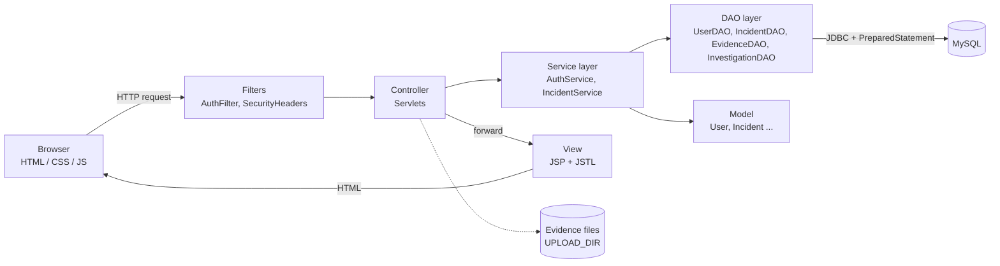
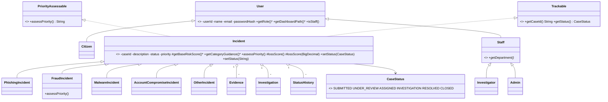
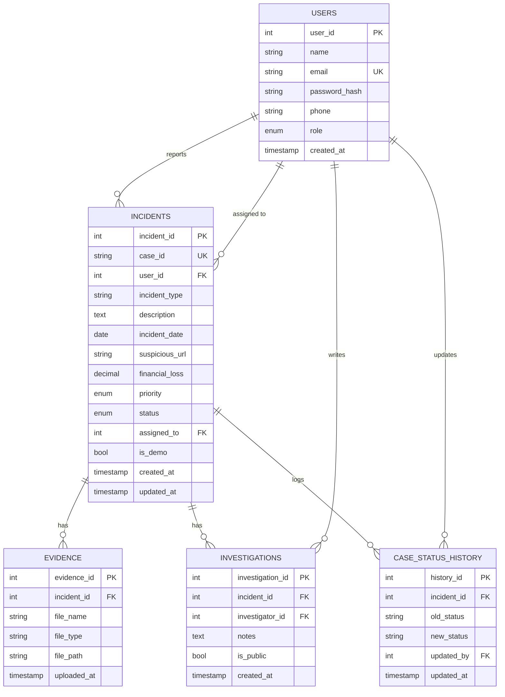

# Diagrams (Mermaid - render on GitHub, VS Code "Markdown Preview Mermaid", or https://mermaid.live)

## 1. Architecture (MVC + DAO)

```mermaid
flowchart LR
  B[Browser<br/>HTML / CSS / JS] -->|HTTP request| F[Filters<br/>AuthFilter, SecurityHeaders]
  F --> C[Controller<br/>Servlets]
  C --> S[Service layer<br/>AuthService, IncidentService]
  S --> D[DAO layer<br/>UserDAO, IncidentDAO, EvidenceDAO, InvestigationDAO]
  D -->|JDBC + PreparedStatement| DB[(MySQL)]
  S --> M[Model<br/>User, Incident ...]
  C -->|forward| V[View<br/>JSP + JSTL]
  V -->|HTML| B
  C -.-> U[(Evidence files<br/>UPLOAD_DIR)]
```

## 2. OOP class diagram

```mermaid
classDiagram
  class PriorityAssessable { <<interface>> +assessPriority() String }
  class Trackable { <<interface>> +getCaseId() String +getStatus() CaseStatus }
  class User { <<abstract>> -userId -name -email -passwordHash +getRole()* +getDashboardPath()* +isStaff() }
  class Citizen
  class Staff { <<abstract>> +getDepartment()* }
  class Investigator
  class Admin
  User <|-- Citizen
  User <|-- Staff
  Staff <|-- Investigator
  Staff <|-- Admin

  class Incident { <<abstract>> -caseId -description -status -priority #getBaseRiskScore()* +getCategoryGuidance()* +assessPriority() #lossScore() #lossScore(BigDecimal) +setStatus(CaseStatus) +setStatus(String) }
  class PhishingIncident
  class FraudIncident { +assessPriority() }
  class MalwareIncident
  class AccountCompromiseIncident
  class OtherIncident
  Incident <|-- PhishingIncident
  Incident <|-- FraudIncident
  Incident <|-- MalwareIncident
  Incident <|-- AccountCompromiseIncident
  Incident <|-- OtherIncident
  PriorityAssessable <|.. Incident
  Trackable <|.. Incident

  class CaseStatus { <<enumeration>> SUBMITTED UNDER_REVIEW ASSIGNED INVESTIGATION RESOLVED CLOSED }
  class Evidence
  class Investigation
  class StatusHistory
  Incident "1" o-- "*" Evidence
  Incident "1" o-- "*" Investigation
  Incident "1" o-- "*" StatusHistory
  Incident --> CaseStatus
```

## 3. Entity-relationship diagram

```mermaid
erDiagram
  USERS ||--o{ INCIDENTS : reports
  USERS ||--o{ INCIDENTS : "assigned to"
  INCIDENTS ||--o{ EVIDENCE : has
  INCIDENTS ||--o{ INVESTIGATIONS : has
  USERS ||--o{ INVESTIGATIONS : writes
  INCIDENTS ||--o{ CASE_STATUS_HISTORY : logs
  USERS ||--o{ CASE_STATUS_HISTORY : updates
  USERS { int user_id PK string name string email UK string password_hash string phone enum role timestamp created_at }
  INCIDENTS { int incident_id PK string case_id UK int user_id FK string incident_type text description date incident_date string suspicious_url decimal financial_loss enum priority enum status int assigned_to FK bool is_demo timestamp created_at timestamp updated_at }
  EVIDENCE { int evidence_id PK int incident_id FK string file_name string file_type string file_path timestamp uploaded_at }
  INVESTIGATIONS { int investigation_id PK int incident_id FK int investigator_id FK text notes bool is_public timestamp created_at }
  CASE_STATUS_HISTORY { int history_id PK int incident_id FK string old_status string new_status int updated_by FK timestamp updated_at }
```
